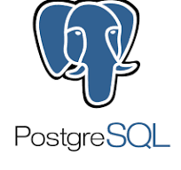

<a name="TP BDD AFORP"></a>

<!-- PROJECT LOGO -->
<br />
<div align="center">
  <a href="https://github.com/simsim18/aforp-tp-bdd">
    
  </a>

  <h3 align="center">TP BDD M1 CARE</h3>

  <p align="center">
    Ici se trouve le TP de BDD de M1 CARE pour l'AFORP par NOGARET Simonb et GHACHI Walid
    <br />
</div>


<!-- TABLE OF CONTENTS -->
<details>
  <summary>Table of Contents</summary>
  <ol>
    <li>
      <a href="#about-the-project">About The Project</a>
      <ul>
        <li><a href="#built-with">Built With</a></li>
      </ul>
    </li>
    <li>
      <a href="#getting-started">Getting Started</a>
      <ul>
        <li><a href="#prerequisites">Prerequisites</a></li>
        <li><a href="#installation">Installation</a></li>
      </ul>
    </li>
    <li><a href="#usage">Usage</a></li>
    <li><a href="#license">License</a></li>
    <li><a href="#contact">Contact</a></li>
  </ol>
</details>


<!-- ABOUT THE PROJECT -->
## About The Project

Le but de ce projet est de créer une base de données permetant une évalution par zone géographique des consommations d'énergie. Ceci à pour but d'être ensuite utilisé par des entreprises de fourniture d'énergie afin de mieux cibler leurs clients et de mieux comprendre leurs besoins.

<p align="right">(<a href="#readme-top">back to top</a>)</p>


### Built With

Ce projet est basée sur le SGBD PostgreSQL et est écrit en SQL.

Le tout est montée sur un docker-compose afin de pouvoir être déployé facilement.

<p align="right">(<a href="#readme-top">back to top</a>)</p>


<!-- GETTING STARTED -->
### Prerequisites

Pour commencer, il faut avoir installé docker et docker-compose sur votre machine.

Le port 80 doit être libre sur votre machine.

### Installation

1. Cloner le repo
   ```sh
   git clone

2. Accédez à PG-ADMIN à l'adresse suivante [http://localhost](http://localhost)

3. Les identifiants sont dans le mail que nous vous avons envoyé.

<p align="right">(<a href="#readme-top">back to top</a>)</p>


<!-- USAGE EXAMPLES -->
## Usage

Vous pouvez ensuite effectuer des requêtes SQL sur la base de données.

<p align="right">(<a href="#readme-top">back to top</a>)</p>


<!-- LICENSE -->
## License

Code réalisé dans un cadre scolaire pour l'AFORP.
Utilisation libre dans un cadre universitaire à vue pédagogique et but non lucratif.

<p align="right">(<a href="#readme-top">back to top</a>)</p>


<!-- CONTACT -->
## Contact

Simon NOGARET - [@simon_nogaret](https://www.linkedin.com/in/simon-nogaret/) - simon.nogaret.ns@gmail.com

Project Link: [https://github.com/simsim18/aforp-tp-bdd](https://github.com/simsim18/aforp-tp-bdd)

<p align="right">(<a href="#readme-top">back to top</a>)</p>